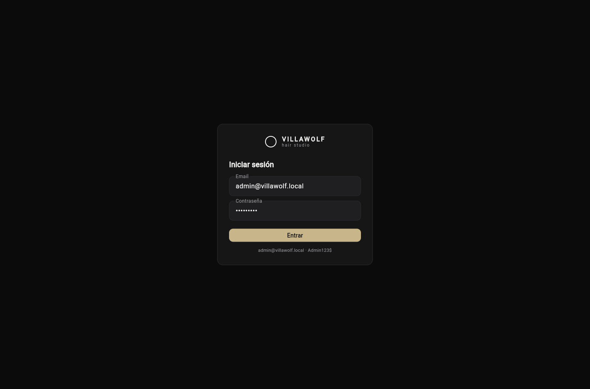
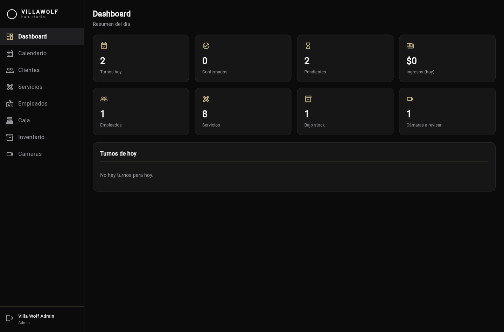
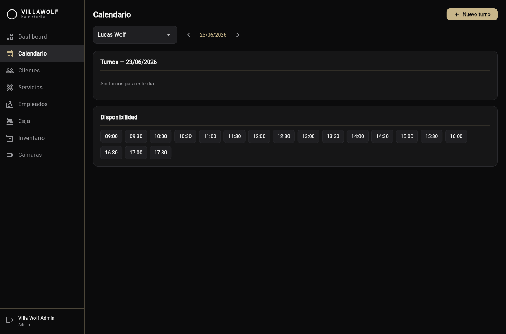

# VILLAWOLF · hair studio — Management app

A full-stack management app for a unisex hair studio: appointments, services, clients, staff
agendas, availability, cash-box, inventory, device monitoring and reminders. Backend in **.NET 10**,
frontend in **Flutter** (web + mobile from one codebase).

> **Brand:** minimalist black & white, "VILLAWOLF" wordmark with the *hair studio* tagline and a
> circular ring motif. The Flutter UI (Iteration 4) follows this identity — see
> [docs/BRAND.md](docs/BRAND.md).

> **Status:** all 7 iterations implemented — auth, catalogue, clients, appointments, the availability
> engine, cash-box, inventory, cameras and (mocked, decoupled) Google Calendar on the backend, plus
> the Flutter app (login, dashboard, calendar, cash-box, inventory, cameras). Verified by a clean
> build, **18 integration/domain tests**, `flutter analyze` + `flutter build web`, and a **live
> end-to-end run under Docker + PostgreSQL** (auth → booking → the no-overlap rule returning `409`,
> admin overbooking succeeding, and the `btree_gist` exclusion constraint confirmed in the database).
> See [docs/ITERATIONS.md](docs/ITERATIONS.md) for the per-iteration log.

## Screenshots

Flutter web client (dark monochrome VILLAWOLF theme), running against the Dockerized API + PostgreSQL.

| Login | Dashboard | Calendar (availability engine) |
| --- | --- | --- |
|  |  |  |

## Tech stack

| Area | Technology |
| --- | --- |
| Language / runtime | C# / .NET 10 |
| Web API | ASP.NET Core (controllers) |
| Persistence | EF Core 10 + PostgreSQL (Npgsql) |
| Auth | ASP.NET Core Identity + JWT bearer |
| Validation / Logging / Docs | FluentValidation · Serilog · Swagger/OpenAPI |
| Frontend | Flutter (Web · Android · iOS) — Riverpod · go_router · Dio |
| Testing | xUnit · FluentAssertions · EF Core InMemory |
| Containers | Docker + Docker Compose |

## Architecture

Clean Architecture, dependencies pointing inwards: `Api → Application / Infrastructure → Domain`.
The domain is framework-free and holds entities, invariants and (in later iterations) the scheduling
logic. See [docs/architecture.md](docs/architecture.md).

```
src/
  VillaWolf.Domain          # entities, enums, Result/Error (no framework deps)
  VillaWolf.Application      # use cases, DTOs, validators, abstractions
  VillaWolf.Infrastructure   # EF Core, Identity/JWT, repositories, migrations, seed
  VillaWolf.Api              # controllers, middleware, Swagger, Program
```

## Why PostgreSQL

Beyond being free and Docker-friendly, PostgreSQL lets the **no-overlap rule for an employee's agenda
be enforced by the database itself** via an exclusion constraint
(`EXCLUDE USING gist (EmployeeId =, tstzrange(start, end) &&)`), not only in application code —
overlapping bookings are physically impossible. It also gives native `timestamptz` and `jsonb`
(used for flexible client preferences).

## API overview

Documented with Swagger at the app root. Main groups:

| Area | Endpoints |
| --- | --- |
| Auth | `POST /api/auth/login` · `GET /api/auth/me` |
| Employees | `GET/POST/PUT /api/employees` · `PATCH .../activate` · `.../deactivate` |
| Catalogue | `/api/services` · `/api/service-addons` · `/api/service-categories` |
| Clients | `GET/POST/PUT /api/clients` · `GET /api/clients/{id}/appointments` |
| Appointments | `GET/POST /api/appointments` · `.../confirm｜start｜complete｜cancel｜no-show` · `.../reschedule` |
| Scheduling | `/api/schedule/working-hours` · `/api/schedule/time-blocks` · `GET /api/schedule/free-slots` |
| Cash-box | `POST /api/payments` · `GET /api/payments` · `GET /api/payments/summary` |
| Inventory | `/api/products` · `POST /api/products/movements` · `GET /api/products/{id}/movements` |
| Cameras | `/api/cameras` · `.../status` · `.../battery` · `.../maintenance` |
| Calendar | `/api/calendar/integrations` · `POST /api/calendar/appointments/{id}/export` |

## Getting started

### Docker (recommended)

```bash
docker compose up --build
```

- API + Swagger UI: <http://localhost:8080>
- PostgreSQL: `localhost:5432` (`postgres` / `postgres`, db `villawolf`)

The database is migrated and seeded automatically on startup (roles, an admin user, business
settings and a typical service catalogue).

**Default admin login:** `admin@villawolf.local` / `Admin123$`

Try it: `POST /api/auth/login` with those credentials returns a JWT; paste it into Swagger's
**Authorize** button to call protected endpoints (e.g. `GET /api/auth/me`).

### Run the backend manually

Requires the .NET 10 SDK and a reachable PostgreSQL. Set the connection string and run:

```bash
export ConnectionStrings__Default="Host=localhost;Port=5432;Database=villawolf;Username=postgres;Password=postgres"
dotnet run --project src/VillaWolf.Api
```

### Frontend (Flutter)

The app lives in `frontend/villawolf_app` (web + Android + iOS, Riverpod + go_router + Dio,
monochrome VILLAWOLF theme). With the backend running:

```bash
cd frontend/villawolf_app
flutter pub get
flutter run -d chrome --dart-define=API_BASE_URL=http://localhost:8080
```

Log in with the seeded admin (`admin@villawolf.local` / `Admin123$`). Screens: login, dashboard
(today's KPIs) and the calendar (per-professional day view with appointments and free slots).

## Roles

`Admin` · `Barber` (barber/stylist) · `Reception` · `Client` (customer app — later phase).

## Privacy note (security cameras)

The shop uses solar security cameras. The cameras module is **device administration and monitoring
only** — registering cameras, status, battery level and maintenance. It performs **no facial
recognition** and stores **no biometric data** of any kind.

## What this project demonstrates

- **Backend architecture** — Clean Architecture with clear layer boundaries, dependency inversion via
  an `IAppDbContext` abstraction, the Result pattern and centralized `ProblemDetails` errors.
- **Domain modeling** — rich entities with invariants (appointments, services, agendas, payments,
  inventory, cameras), price/duration snapshots, and soft-delete to preserve history.
- **A real scheduling engine** — timezone-aware availability (working hours, time blocks, overlap),
  free-slot generation, admin-authorized overbooking, and a **database-enforced** no-overlap guarantee
  via a PostgreSQL exclusion constraint.
- **API design & security** — RESTful controllers, JWT auth with role-based authorization, request
  validation (FluentValidation), Swagger.
- **Decoupled integrations** — Google Calendar behind a swappable provider interface (mocked now).
- **Testing** — 18 xUnit tests (domain + application over EF Core InMemory) covering the critical rules.
- **Frontend integration** — a Flutter app (web + mobile) consuming the API with a clean, branded UI.
- **Tooling** — Docker Compose (PostgreSQL + API, auto migrate + seed), structured logging.

## Roadmap

See [docs/ITERATIONS.md](docs/ITERATIONS.md). All 7 iterations are implemented and verified live
end-to-end under Docker + PostgreSQL. The remaining follow-ups are UI screenshots for this README and
real Google OAuth in place of the mocked calendar provider.
