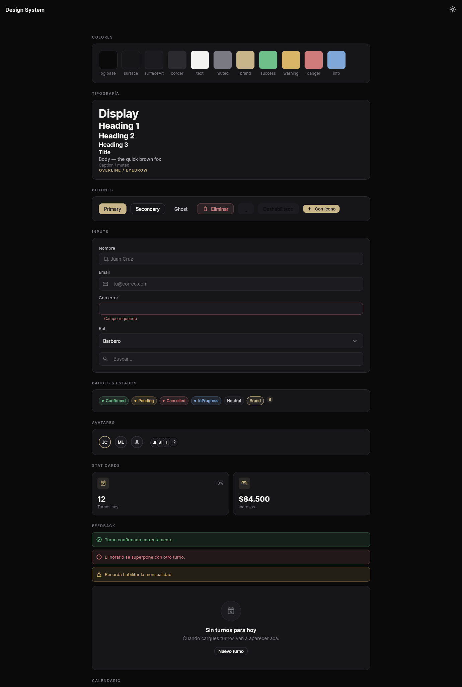
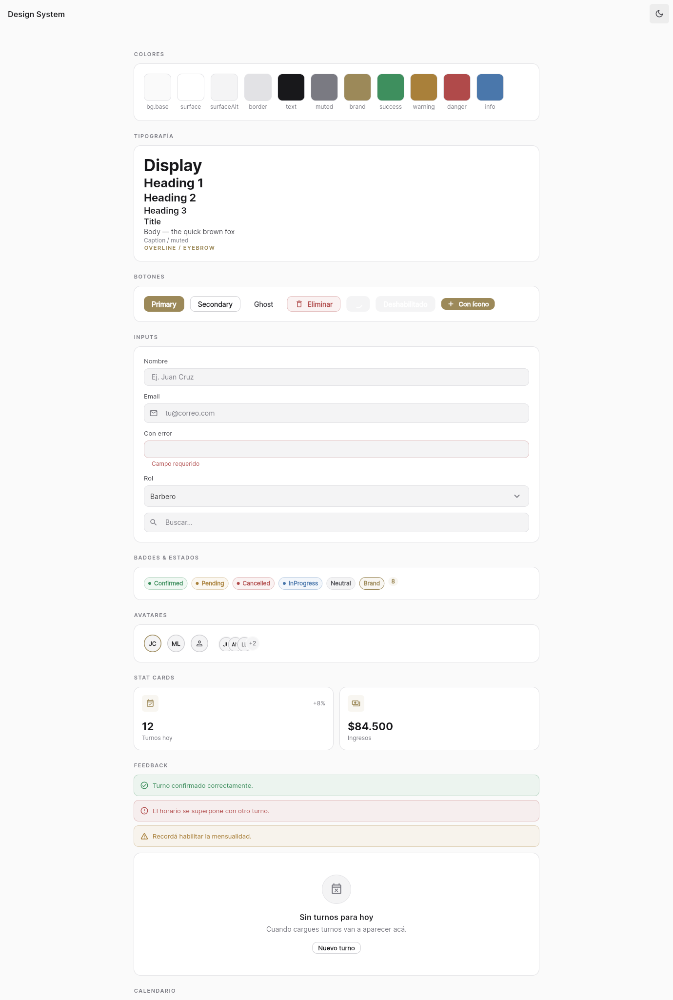

# Villa Wolf — Design System

A tokenized design system for the Villa Wolf app: one source of truth in code that drives the Flutter
themes (dark + light) and mirrors into Figma. Built for a premium, monochrome dev/admin-dashboard feel
(inspired by Linear, Vercel/Geist, Stripe and Notion) over the brand's black & white identity with a
champagne accent.

> **Why tokens?** Every colour/role is read from the active theme via `context.tokens`, never from a
> hardcoded constant. Switching dark↔light is a token swap — and so is the future **per-barbershop
> white-label theming**: a barbershop's brand is just another `AppTokens` preset.




## Architecture

```
lib/src/design/
  tokens/        ref_tokens · semantic_tokens (AppTokens, incl. elevation shadows) · typography · spacing · radius · motion
  theme/         app_tokens_extension (context.tokens) · app_theme (AppTheme.dark()/light())
  components/    avatar · badges · buttons · cards · data_display · feedback · inputs · navigation · overlays · calendar_primitives
  gallery/       ds_gallery_page  (kitchen-sink, route /_ds)
  design.dart    barrel (one import for the whole DS)
```

- **`AppTokens`** (`tokens/semantic_tokens.dart`) is a `ThemeExtension` holding every semantic colour
  role + elevation shadows. Two factories ship: `AppTokens.dark()` (default) and `AppTokens.light()`.
- **`AppTheme`** (`theme/app_theme.dart`) turns a token set into Material `ThemeData`. `main.dart`
  wires `theme: AppTheme.light()`, `darkTheme: AppTheme.dark()`, `themeMode` from
  `themeControllerProvider` (persisted via shared_preferences; defaults to dark).
- Access tokens anywhere with **`context.tokens`** (`theme/app_tokens_extension.dart`).

## Tokens

| Group | Tokens |
| --- | --- |
| Surfaces | `bgBase`, `bgSurface`, `bgSurfaceAlt`, `bgElevated` |
| Borders | `borderSubtle`, `borderDefault`, `borderStrong` |
| Text | `textPrimary`, `textSecondary`, `textMuted`, `textDisabled`, `textInverse` |
| Brand | `brand`, `brandHover`, `brandSubtle`, `onBrand` |
| Status | `{success,warning,danger,info}{Fg,Bg,Border}` (desaturated, per BRAND.md) |
| State | `hoverOverlay`, `pressedOverlay`, `focusRing` |
| Elevation | `shadowSm`, `shadowMd`, `shadowLg` (per mode) |

- **Typography** — Inter (`google_fonts`). Scale: `display, h1, h2, h3, title, bodyLg, body, bodySm,
  caption, overline`. `overline` = uppercase + wide tracking (wordmark / section eyebrows).
- **Spacing** (`AppSpacing`) — base-4: `xxs 2 · xs 4 · sm 8 · md 12 · lg 16 · xl 20 · xl2 24 · xl3 32 …`.
- **Radius** (`AppRadius`) — `sm 6 · md 10 · lg 14 · xl 20 · full`.
- **Sizing** (`AppSizing`) — control heights `32/40/48`, icons `16/20/24`.
- **Motion** (`AppMotion`) — `fast 120 · base 200 · slow 320 ms`, `standard`/`emphasized` curves.

## Components

`avatar` (Avatar with ring motif, AvatarGroup, BrandMark) · `badges` (AppBadge, StatusBadge,
CountBadge + `BadgeColors.intentForStatus`) · `buttons` (AppButton — primary/secondary/ghost/
destructive × sm/md/lg, loading/icon; AppIconButton) · `cards` (SurfaceCard, SectionCard, StatCard) ·
`inputs` (AppTextField, AppDropdown, AppSearchField, FieldLabel) · `navigation` (NavItem, TopBar,
SegmentedTabs) · `feedback` (RingLoader, EmptyState, ErrorState, InlineAlert, Skeleton,
`showAppSnackBar`) · `overlays` (`showConfirmDialog`, `showAppBottomSheet`) · `data_display`
(KeyValueRow, DataRow2, DataList) · `calendar_primitives` (DayHeader, TimeGridCell, AppointmentBlock).

Browse them all live at route **`/_ds`** (the gallery), with a dark/light toggle.

## Compatibility & migration

The 13 existing feature screens still reference colours via the legacy **`AppColors`**
(`lib/src/core/theme.dart`) — now a const facade whose values mirror the **dark** tokens, so those
screens compile unchanged and are pinned to the dark preset. `lib/src/ui/widgets.dart` re-exports the
DS and keeps thin adapters (`PanelCard→SurfaceCard`, `MetricCard→StatCard`,
`LabeledDropdown→AppDropdown`, `StatusChip→StatusBadge`).

**Next pass:** migrate each screen from `AppColors`/legacy adapters to `context.tokens` + canonical
components, which also makes light mode (and per-barbershop themes) fully apply to every screen.

## Figma

The same tokens are mirrored to a Figma library (variables with Dark/Light modes, text styles and a
component set) via the official Figma MCP, so design and code stay in sync. Keep
`semantic_tokens.dart` as the source of truth; update Figma variables to match when tokens change.

## Verify

```bash
cd frontend/villawolf_app
C:\flutter\bin\flutter.bat analyze        # clean
C:\flutter\bin\flutter.bat build web      # ok
C:\flutter\bin\flutter.bat run -d chrome  # open /#/_ds and toggle the theme
```
